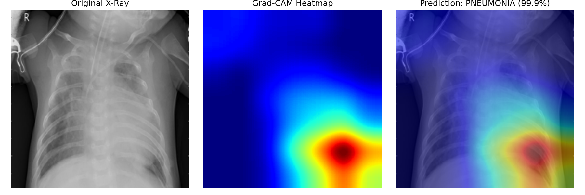

# Chest X-Ray Pneumonia Classifier

A deep learning web application that detects pneumonia from chest X-ray images, with **Grad-CAM** visualization to highlight the regions the model used for its prediction.

**🔗 Live Demo:** https://chest-xray-classification-qzmkfcfemcobjpzmbfvfpy.streamlit.app/



---

## Overview

This project fine-tunes a pre-trained ResNet18 on the Kaggle Chest X-Ray dataset to perform binary classification (pneumonia vs. normal). To make the predictions interpretable for medical use cases, the app generates a Grad-CAM heatmap overlaid on the original X-ray, showing which lung regions influenced the model's decision.

The full pipeline — training, evaluation, and a Streamlit web interface — is included in this repository.

---

## Features

- **Transfer learning** with ImageNet-pretrained ResNet18
- **Grad-CAM** visualization for model interpretability
- **Streamlit** web interface for image upload and inference
- Deployed on **Streamlit Community Cloud**

---

## Tech Stack

| Component | Technology |
|---|---|
| Model | ResNet18 (transfer learning) |
| Framework | PyTorch |
| Interpretability | Grad-CAM |
| Frontend | Streamlit |
| Deployment | Streamlit Community Cloud |

---

## Dataset

- **Source:** [Kaggle Chest X-Ray Images (Pneumonia)](https://www.kaggle.com/datasets/paultimothymooney/chest-xray-pneumonia)
- **Size:** ~5,200 images
  - Pneumonia: 3,875
  - Normal: 1,341
- **Class ratio:** approximately 3:1 (imbalanced)

---

## Results

After 5 epochs of fine-tuning:

| Metric | Value |
|---|---|
| Test Accuracy | **84.62%** |
| Train Accuracy (final epoch) | 97.76% |
| Test Set Size | 624 images (390 pneumonia, 234 normal) |

**Caveats — what these numbers don't tell you:**

- **Accuracy is misleading on imbalanced data.** A baseline that always predicts "pneumonia" would achieve ~62.5% accuracy without learning anything. The true measure of model quality on medical data should include AUC, sensitivity, and specificity (see [Limitations](#limitations--future-work)).
- **The ~13% gap between train and test accuracy** suggests mild overfitting — addressable with a learning rate scheduler, early stopping, and a properly-sized validation set.
- **Validation accuracy was unstable** during training (ranged from 68.75% to 87.50% across epochs) because the original Kaggle validation set contains only 16 images — a single misclassified image shifts the metric by 6.25%.

---

## How It Works

### Model Architecture

The final fully-connected layer of ResNet18 is replaced from `Linear(512, 1000)` to `Linear(512, 2)` to match the binary classification task. All layers are fine-tuned during training (no frozen layers).

### Training Configuration

- **Optimizer:** Adam (lr = 0.001)
- **Loss:** CrossEntropyLoss
- **Batch size:** 32
- **Epochs:** 5
- **Input size:** 224 × 224
- **Normalization:** ImageNet statistics (mean = [0.485, 0.456, 0.406], std = [0.229, 0.224, 0.225])
- **Augmentation:** RandomRotation(10°), Resize

### Grad-CAM

Two hooks are registered on the last convolutional layer (`layer4`):

- A **forward hook** captures the feature map (7×7×512)
- A **backward hook** captures the gradients of the predicted class with respect to the feature map

The gradients are averaged across the spatial dimensions to produce per-channel importance weights. These weights are combined with the feature maps in a weighted sum, passed through ReLU to keep only positive contributions, resized to the original image dimensions, and overlaid on the input X-ray as a heatmap.

---

## Getting Started

### Prerequisites

- Python 3.10+
- pip

### Installation

```bash
git clone https://github.com/ShengweiJiang/chest-xray-classification.git
cd chest-xray-classification
python -m venv .venv
source .venv/bin/activate    # On Windows: .venv\Scripts\activate
pip install -r requirements.txt
```

### Running the App

The trained model (`chest_xray_model.pth`) is included in the repository, so you can run the app directly without retraining:

```bash
streamlit run app.py
```

Open the URL printed in your terminal (default: `http://localhost:8501`).

### Retraining (Optional)

If you'd like to retrain the model yourself, download the dataset from [Kaggle](https://www.kaggle.com/datasets/paultimothymooney/chest-xray-pneumonia) and extract it into the project root:

```
chest_xray/
├── train/
│   ├── NORMAL/
│   └── PNEUMONIA/
├── val/
│   ├── NORMAL/
│   └── PNEUMONIA/
└── test/
    ├── NORMAL/
    └── PNEUMONIA/
```

Then run:

```bash
python train.py
```

---

## Project Structure

```
chest-xray-classification/
├── app.py                  # Streamlit web app
├── train.py                # Training script
├── gradcam.py              # Grad-CAM implementation
├── check_data.py           # Dataset sanity check
├── chest_xray_model.pth    # Trained model weights
├── gradcam_result.png      # Example Grad-CAM output
├── requirements.txt
├── .gitignore
└── README.md
```

---

## Limitations & Future Work

This project is a portfolio demo, not a production medical tool. Known limitations and planned improvements:

1. **Fixed learning rate.** A learning rate scheduler (e.g., `StepLR`) would help convergence in later epochs.
2. **No early stopping.** Currently saves the model after the last epoch instead of the best-performing one on the validation set.
3. **Class imbalance not addressed.** The 3:1 ratio could be handled with class weights in `CrossEntropyLoss` or with focal loss.
4. **Accuracy-only evaluation.** AUC, sensitivity, and specificity are more meaningful for medical classification, especially under class imbalance.
5. **Validation set is too small (16 images).** Stratified k-fold cross-validation, or merging the original val/test sets and re-splitting, would yield more reliable estimates.

> ⚠️ **Medical Disclaimer:** This model is for educational purposes only. It has not been validated for clinical use and must not be used as a substitute for professional medical diagnosis.

---

## Acknowledgments

- Dataset: [Kermany et al., Kaggle](https://www.kaggle.com/datasets/paultimothymooney/chest-xray-pneumonia)
- Pretrained model: [torchvision ResNet18](https://pytorch.org/vision/stable/models/resnet.html)
- Grad-CAM: Selvaraju et al., *"Grad-CAM: Visual Explanations from Deep Networks via Gradient-based Localization"* (ICCV 2017)
